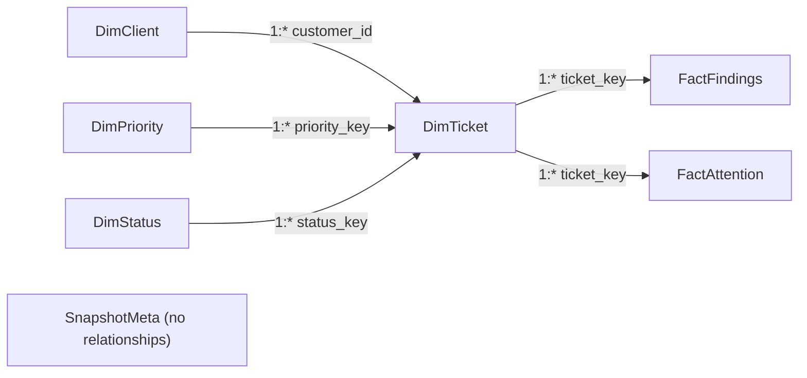

# Relationships (star schema)

Single snapshot. No date table. No role-playing date dimensions. Do **not** relate anything on `ticket_id` — that column is **not unique** (duplicate `TCK-1020`).

## Model diagram

```text
                    ┌──────────────┐
                    │  DimClient   │
                    │ customer_id  │
                    └──────┬───────┘
                           │ 1:*  (single →)
                           ▼
┌─────────────┐     ┌──────────────┐     ┌─────────────┐
│ DimPriority │1:*  │  DimTicket   │  * :1│ DimStatus   │
│priority_key ├────►│  ticket_key  │◄────┤ status_key  │
└─────────────┘     │  (csv row)   │     └─────────────┘
                    └──┬───────┬───┘
                       │       │
              1:*      │       │      1:*
         (single →)    │       │    (single →)
                       ▼       ▼
              ┌────────────┐ ┌───────────────┐
              │FactFindings│ │ FactAttention │
              │evidence_id │ │ evidence_id   │
              └────────────┘ └───────────────┘

              ┌──────────────┐
              │ SnapshotMeta │  disconnected (cards / banner only)
              └──────────────┘
```



## Relationships to create

Cross-filter direction is **single** (dimension filters tickets/facts). Do not enable bidirectional filtering.

| From (1) | To (*) | Key | Why |
| --- | --- | --- | --- |
| `DimClient[customer_id]` | `DimTicket[customer_id]` | `customer_id` | Client slicer filters open-ticket row counts |
| `DimPriority[priority_key]` | `DimTicket[priority_key]` | `priority_key` | Priority slicer |
| `DimStatus[status_key]` | `DimTicket[status_key]` | `status_key` | Status slicer |
| `DimTicket[ticket_key]` | `FactFindings[ticket_key]` | `ticket_key` | Finding KPIs and breach chart follow ticket filters |
| `DimTicket[ticket_key]` | `FactAttention[ticket_key]` | `ticket_key` | Attention table follows ticket filters |

`ticket_key` is the CSV row number from the parser (header = row 1, first data row = 2). It is unique even when `ticket_id` repeats.

## Relationships to reject

Power Query / Desktop auto-detect will try to create extra links. **Delete them.**

| Do not create | Reason |
| --- | --- |
| `DimTicket[ticket_id]` → `FactFindings[ticket_id]` | Many-to-many: `TCK-1020` is two DimTicket rows; findings would fan out or fail to bind |
| `DimTicket[ticket_id]` → `FactAttention[ticket_id]` | Same duplicate-id problem; attention also has two rows for `TCK-1020` |
| `DimClient` → `FactFindings[customer_id]` | Ambiguous path (Client → Ticket → Findings already exists) |
| `DimClient` → `FactAttention[customer_id]` | Ambiguous path |
| `DimPriority` → `FactFindings[priority]` | Ambiguous path; `FactFindings[priority]` is a denormalized attribute, not a key |
| `DimStatus` → `FactFindings[status]` | Ambiguous path |
| Anything involving `SnapshotMeta` | One-row label table; keep disconnected |
| Date tables / `as_of` joins | Single snapshot; no historical trend |

## Duplicate `ticket_id` handling (DimTicket)

| `ticket_key` | `ticket_id` | `ticket_id_instance` | `is_duplicate_ticket_id` | Notes |
| --- | --- | --- | --- | --- |
| 21 | TCK-1020 | 1 | 1 | Created 2026-09-15; ageing finding maps here |
| 22 | TCK-1020 | 2 | 1 | Created 2026-09-19; attention `attention:TCK-1020:row-22` maps here |

Phase A does **not** pick a canonical duplicate. SLA clocks are skipped on both rows (`sla_eligible = 0`). Ageing still evaluates per row (row 21 is ≥48h open; row 22 is not).

Empty CSV `ticket_id` is labeled `ROW-24` (`ticket_key` 24), matching Phase A.

## FactAttention deadline

`FactAttention.linked_deadline` is **not** a new metric. It is the earliest `computed_deadline` among the attention row’s `source_evidence_ids` that point at a breach or approaching finding.

Example: `TCK-1021` has response deadline `2026-09-19T04:15:00+00:00` and resolve deadline `2026-09-19T08:00:00+00:00`. The table shows **04:15** (earliest), not a sum, not a second row.

## Filter flow for the page

Slicers live on **DimClient / DimPriority / DimStatus** (not on fact tables).

1. Slicer filters the dim.
2. Dim filters `DimTicket`.
3. `DimTicket` filters `FactFindings` and `FactAttention`.
4. KPI measures that `CALCULATE` on findings therefore respect client / priority / status.

Use `DimClient[customer_id]` as the axis for “Breached tickets by client” so a bar click filters the same path (not `FactFindings[customer_id]`).
